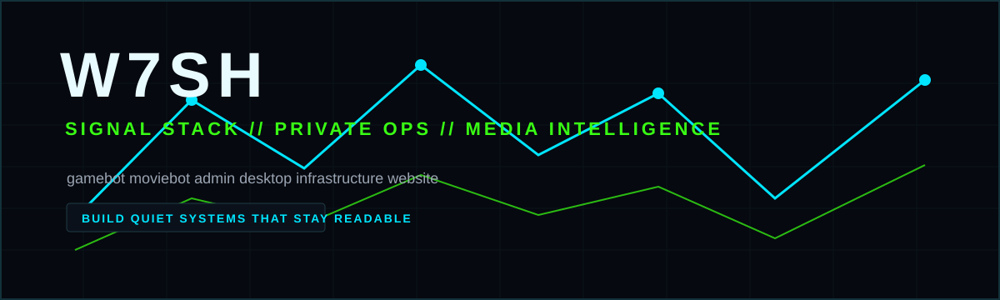

<p align="center">
  
</p>

<pre align="center">
██╗    ██╗███████╗███████╗██╗  ██╗
██║    ██║╚════██║██╔════╝██║  ██║
██║ █╗ ██║    ██╔╝███████╗███████║
██║███╗██║   ██╔╝ ╚════██║██╔══██║
╚███╔███╔╝   ██║  ███████║██║  ██║
 ╚══╝╚══╝    ╚═╝  ╚══════╝╚═╝  ╚═╝
        SIGNAL STACK // PRIVATE OPS // MEDIA INTELLIGENCE
</pre>

<h1 align="center">W7SH</h1>

<p align="center">
  Private software ecosystem for game alerts, movie and TV intelligence, operations tooling, and production infrastructure.
</p>

<p align="center">
  
  
  
  
</p>

The work is designed around clear release discipline, clean source exports, explicit secret boundaries, and maintainable operator workflows.

## Signal

W7SH is a private, service-oriented stack for monitoring games, movies, user preferences, recommendations, and operational health. The core repositories are intentionally private, but the public profile documents the shape of the ecosystem and the engineering standards used across it.

```text
┌─ W7SH CONTROL PLANE ─────────────────────────────────────────────┐
│  gamebot     -> game discovery, free alerts, store intelligence  │
│  moviebot    -> media discovery, recommendations, AI responses   │
│  admin       -> desktop and web operations console               │
│  infra       -> private deployment fabric and rollback overlays  │
│  website     -> public landing, legal pages, aggregate stats     │
│  arcade      -> public W7SH Space Invaders experiment            │
└──────────────────────────────────────────────────────────────────┘
```

## Ecosystem

| Service | Role | Status |
| --- | --- | --- |
| `w7sh-gamebot` | Telegram game discovery, free-game alerts, store intelligence, recommendations, and internal telemetry. | Private core |
| `w7sh-moviebot` | Movie and TV discovery, multilingual AI responses, media recommendations, and service telemetry. | Private core |
| `w7sh-admin` | FastAPI admin backend, browser console, and secure Electron desktop operations app. | Private core |
| `w7sh-infra` | Docker Compose deployment fabric, private networks, PostgreSQL, monitoring, proxy management, and rollback overlays. | Private core |
| `w7sh-website` | Public landing surface, bilingual pages, legal routes, health check, and internal stats aggregation. | Private core |
| `space_invaders` | Enhanced neon arcade shooter with levels, shields, power-ups, enemy fire, particles, and headless validation. | Public |

## Engineering Standard

- Documentation-first repository maintenance.
- Semantic versioning with `vMAJOR.MINOR.PATCH` tags.
- Changelog entries for every meaningful change.
- Conventional Commit messages for readable history.
- Release notes that call out features, fixes, migrations, security notes, and validation.
- `.env.example` files with blank values only.
- Secret scans before every push.
- No production data, logs, databases, backups, or credentials in Git.

## Repository Rhythm

```text
docs updated -> validation run -> secret scan -> clean commit -> tag when released -> release notes published
```

Every W7SH repository is expected to keep its README current, document env vars and deployment assumptions, maintain a security policy, and make future changes easy to review.

## Public Links

- Public arcade project: [space_invaders](https://github.com/xXw7shXx/space_invaders)
- Profile source: [xXw7shXx](https://github.com/xXw7shXx/xXw7shXx)

Private repositories are visible only to authorized collaborators.
